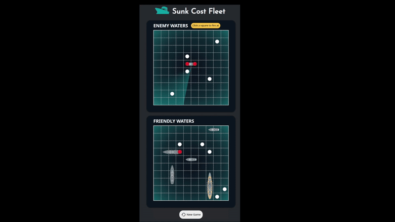

# Sunk Cost Fleet

A website to play battleships against a computer. Built with HTML5, CSS3, and JavaScript (ES6+), bundled and optimized using Webpack.

👉 [Live Demo](https://ckyever.github.io/sunk-cost-fleet)

## Acknowledgement

Inspired from [The Odin Project](https://www.theodinproject.com/lessons/node-path-javascript-battleship)

## License

- [MIT License](https://opensource.org/license/MIT)
- Copyright © 2025 Ckyever Gaviola
